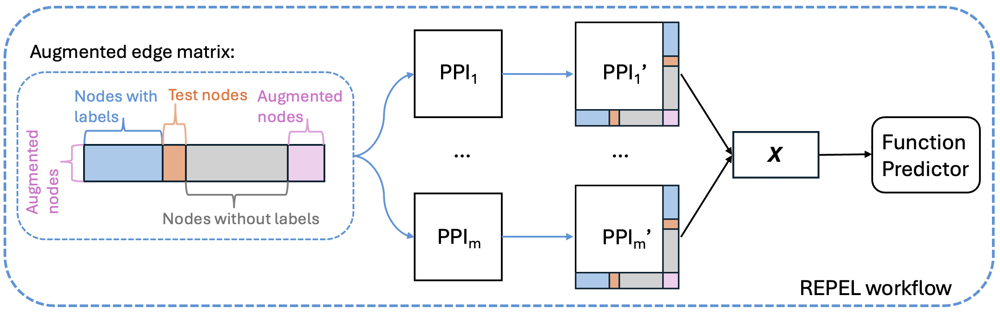

# REPEL - Random Embedding Perturbation for Enhanced Learning of Protein Function

	

---

## 🧪 Setup

### Requirements

- python 3.12
- pandas
- numpy
- networkx
- scipy
- scikit-learn
- matplotlib
